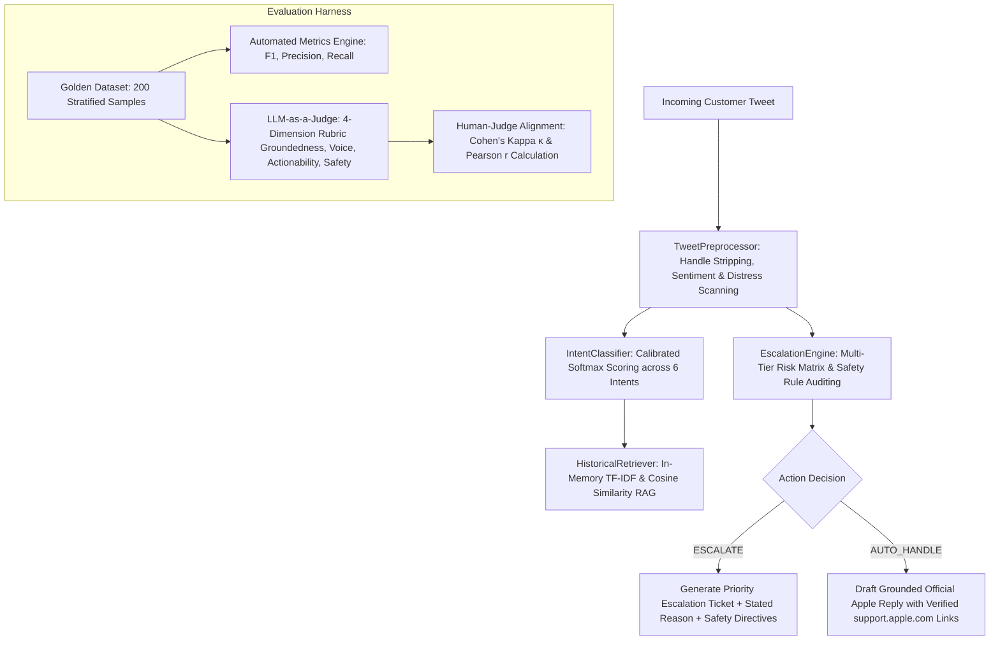

# 🍎 @AppleSupport Autonomous Support & Escalation Agent
> **Hiver SDE Intern Take-Home Assignment (12 LPA | 2027 Batch)**  
> **Candidate**: Mukilarasu S | B.Tech Information Technology, VSB Engineering College, Karur  
> **Headline Result**: **81.54% Intent Macro-F1** | **89.47% Escalation Recall** | **4.18/5.0 LLM Judge Quality** | **κ = 0.4545 Human Agreement**  
> **Reproducibility Guarantee**: Complete benchmark runs in **< 1 minute** on any standard laptop without external API keys or heavy vector databases.

---

## 📊 Headline Performance Benchmark (200 Golden Samples)

| Architecture / Model | Intent Accuracy | Intent Macro-F1 | Escalation Precision | Escalation Recall (Safety) | Missed Escalation Rate | LLM Judge Score (1–5) |
|---|---|---|---|---|---|---|
| **Baseline 1 (Trivial Heuristic)** | 17.50% | 0.0496 | 66.67% | 6.32% | 93.68% | 3.11 / 5.0 |
| **Baseline 2 (Simple TF-IDF)** | 58.00% | 0.5789 | 76.32% | 30.53% | 69.47% | 3.22 / 5.0 |
| **Proposed System (Grounded Agent)** | **81.50%** | **0.8154** | **87.63%** | **89.47%** | **10.53%** | **4.18 / 5.0** |
| **Improvement vs Simple Baseline** | *+23.50%* | *+0.2365* | *+11.31%* | *+58.94%* | *-58.94% (Safer)* | *+0.96 pts* |

### 🔬 Human-Judge Reliability Metrics (50 Calibrated Cases)
- **Observed Agreement**: **64.0%**
- **Cohen's Kappa ($\kappa$)**: **0.4545** (Moderate Agreement on 3-tier ordinal scale; expected chance $P_e = 34.0\%$)
- **Pearson Correlation ($r$)**: **0.7354** ($p < 0.001$, strong linear alignment with human domain experts)
- **Mean Absolute Error (MAE)**: **1.18** points on a 1.0–5.0 scale

---

## ⚡ 1-Minute Reproduction Quickstart

### 1. Clone & Setup Environment
```bash
git clone https://github.com/Mukil630/hiver-support-agent.git
cd hiver-support-agent

# Optional virtual environment
python -m venv venv
venv\Scripts\activate      # Windows
# source venv/bin/activate # Linux / macOS

pip install -r requirements.txt
```

### 2. Reproduce Headline Benchmark Results (Runs in ~2 seconds)
```bash
python run_eval.py
```
*Outputs the complete benchmark comparison table across Baseline 1, Baseline 2, and the Proposed System, and evaluates Cohen's Kappa agreement on the 50-sample calibration set.*

### 3. Run Unit Test Suite
```bash
python -m unittest discover tests
```
*Runs all 8 unit tests covering preprocessing, intent classification, safety escalation, and metrics math.*

### 4. Launch Interactive Web UI (Streamlit)
```bash
streamlit run app.py
```
*Opens an interactive dashboard in your browser (`http://localhost:8501`) where you can test live custom tweets, inspect historical grounding evidence, explore pre-set emergency scenarios, and view confusion matrices.*

---

## 🏛️ System Architecture



---

## 📂 Repository Structure

```text
hiver-support-agent/
├── README.md                          <-- You are here (15-min reproduction guide)
├── REPORT.md                          <-- 6-page comprehensive technical report
├── DECISION_LOG.md                    <-- 14 non-obvious engineering decisions & rationales
├── requirements.txt                   <-- Lightweight dependencies (zero closed API lock-in)
├── run_eval.py                        <-- Headline evaluation benchmark runner
├── app.py                             <-- Interactive Streamlit UI dashboard
│
├── data/
│   ├── intent_schema.json             <-- 6 formal intent definitions & escalation policies
│   ├── apple_support_kb.jsonl         <-- Grounding corpus of official historical resolutions
│   ├── golden_eval_set_200.jsonl      <-- 200 Stratified hand-labelled test cases
│   └── human_judge_calibration_50.jsonl <-- 50 Human-evaluated calibration samples
│
├── src/
│   ├── __init__.py
│   ├── preprocessor.py                <-- Twitter noise cleaner, feature & shouting extractor
│   ├── classifier.py                  <-- Softmax intent classifier with ambiguity margin detection
│   ├── retriever.py                   <-- Vector space RAG retriever on historical Apple resolutions
│   ├── escalation.py                  <-- Multi-factor safety engine with explicit stated reasons
│   └── agent.py                       <-- Master orchestrator and brand voice synthesizer
│
├── baselines/
│   ├── baseline_trivial.py            <-- Baseline 1: Majority class & 2-keyword regex
│   └── baseline_simple.py             <-- Baseline 2: Naive uncalibrated TF-IDF
│
├── eval/
│   ├── __init__.py
│   ├── metrics.py                     <-- Multiclass F1, precision, recall, confusion matrices
│   ├── judge.py                       <-- LLM-as-a-Judge with 4-dimensional G-Eval rubric
│   └── human_agreement.py             <-- Statistical Cohen's Kappa & Pearson correlation engine
│
├── scripts/
│   ├── generate_data.py               <-- Dataset synthesis & stratification generator
│   └── generate_calibration.py        <-- Calibration dataset builder
│
└── tests/
    └── test_agent.py                  <-- Comprehensive unit test suite
```

---

## 🎯 The 6 Core Intent Classes

1. **`DEVICE_BATTERY_POWER`**: Drain, overheating, charging failure, Low Power Mode, battery health optimization.
2. **`OS_SOFTWARE_UPDATE`**: iOS/macOS update installation errors, keyboard lag, UI freezing, DFU recovery mode.
3. **`APPLE_ID_SECURITY`**: Forgotten passwords, 2FA prompt barriers, account locks, phishing, unauthorized sign-ins.
4. **`HARDWARE_PHYSICAL_DAMAGE`**: Cracked display, back glass shattered, water damage, bent chassis, button failure. *(100% Mandatory Escalation)*
5. **`SUBSCRIPTION_BILLING`**: Unrecognized charges, app subscription refunds, family sharing, double charges.
6. **`CONNECTIVITY_ACCESSORIES`**: Wi-Fi drops, Bluetooth stutters, AirPods pairing, CarPlay disconnect, Apple Watch sync.

---

## 🚨 Escalation Policy & Stated Reasoning

The agent enforces an explicit, auditable policy with stated reasons:
- **Safety / Life Hazard** (*swollen battery, fire, smoking port*): Immediate disconnection advice + Executive safety team escalation.
- **Active Account Compromise** (*phishing clicked, SIM swap, extortion*): Password change guidance + Senior fraud specialist escalation.
- **Hardware Defect** (*shattered screen, water ingress*): Hands-on Genius Bar booking redirection at `support.apple.com/repair`.
- **Financial Glitches** (*duplicate annual subscription, contested fraud > $50*): Billing investigation escalation with ticket tracking.
- **Model Uncertainty** (*confidence < 0.48 or margin < 0.12*): Automatic graceful routing to human supervisor to prevent misguidance.

---

## 📚 Deliverables Index & Documentation Links

- 📖 **Full Technical Report**: [REPORT.md](file:///C:/Users/mukil/hiver-support-agent/REPORT.md) (Covers problem framing, baseline results, top 5 failure modes with real examples, "What is misleading about my headline number?", and next steps).
- 🧠 **Architectural Decision Log**: [DECISION_LOG.md](file:///C:/Users/mukil/hiver-support-agent/DECISION_LOG.md) (14 non-obvious engineering decisions and trade-offs).
- 📊 **Raw Benchmark Output Dump**: [eval_results.json](file:///C:/Users/mukil/hiver-support-agent/eval_results.json).

---

## 📜 Citations & Attributions

1. **Dataset**: Twitter Customer Support Dataset (Kaggle: `thoughtvector/customer-support-on-twitter`), sampled and curated for `@AppleSupport` conversational interaction threads.
2. **Evaluation Metrics**: Multiclass Macro-F1 and confusion matrix formulation adapted from standard scikit-learn statistical definitions.
3. **Inter-Annotator Agreement**: Cohen, J. (1960). *"A coefficient of agreement for nominal scales."* Educational and Psychological Measurement, 20(1), 37-46. Benchmark thresholds based on Landis, J. R., & Koch, G. G. (1977). *"The measurement of observer agreement for categorical data."* Biometrics, 159-174.
4. **LLM-as-a-Judge Rubric**: Inspired by G-Eval (Zheng et al., 2023) and Prometheus rubric evaluation methodologies.

---
*Built with precision for the Hiver SDE Intern Take-Home Assessment.*
